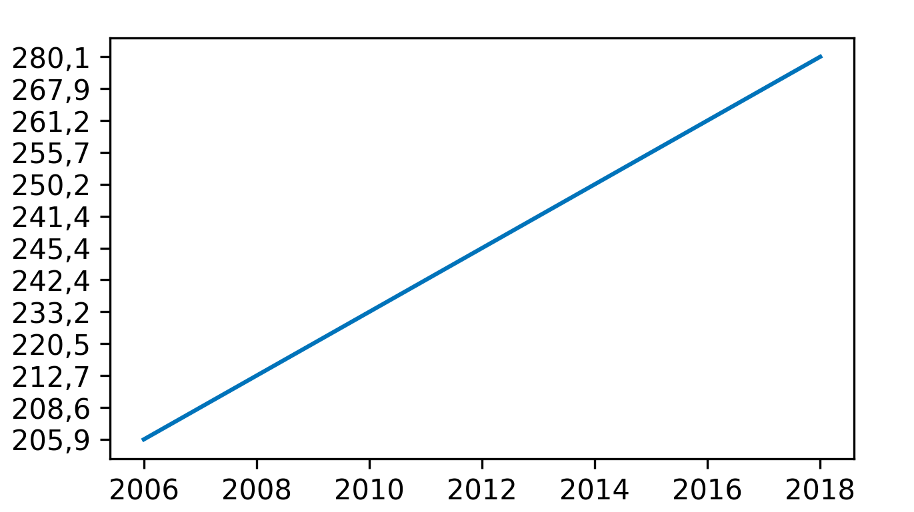

* __MCC Van Dyke et al., 2019:__ Fantastic yeasts and where to find them: the hidden diversity of dimorphic fungal pathogens
* __JT Harvey, Applied Ergonomics, 2002:__ An analysis of the forces required to drag sheep over various surfaces
* __DW Ziegler et al., 2005:__ The neurocognitive effects of alcohol on adolescents and college students  

